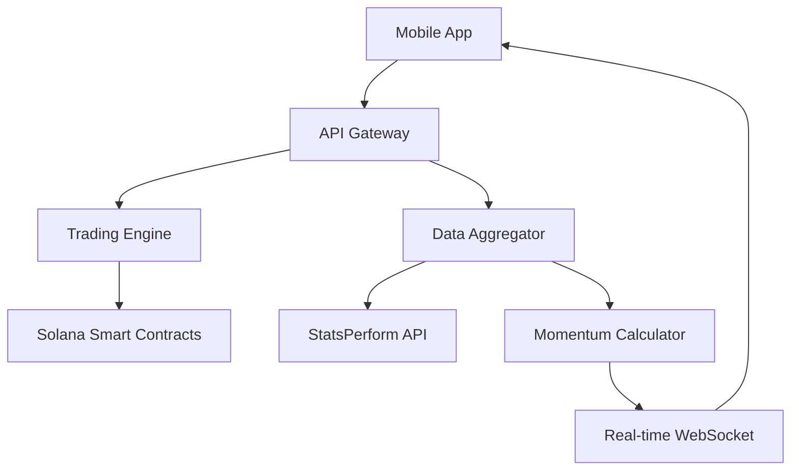

# Futstar - Football Momentum Trading Platform

[](https://solana.com)
[](LICENSE)
[](https://solana.com/hackathon)

## Bringing Hundreds of Millions of Football Fans to Crypto Through Momentum Betting

Futstar revolutionizes sports engagement by enabling real-time momentum trading during live football matches on the Solana blockchain.

### What is Match Momentum?

> "Match Momentum measures the swing of the match by comparing each team's threat to see who is more likely to score within that minute." - BBC Sport

## Key Features

- **Real-time Trading**: Long/Short positions in 5-minute windows during live matches
- **Momentum Index**: 0-100 scale combining possession, shots, xG trend, and field tilt
- **Instant Settlement**: Wins settled immediately based on index movement
- **Low Fees**: Leveraging Solana's <$0.01 transaction fees
- **Mobile-First**: Native Solana app optimized for mobile trading
- **Live Data**: Powered by StatsPerform match data

## Architecture



## Tech Stack

- **Blockchain**: Solana
- **Smart Contracts**: Rust (Anchor Framework)
- **Backend**: Python (FastAPI), Node.js
- **Frontend**: React Native, TypeScript
- **Data Provider**: StatsPerform
- **Infrastructure**: AWS, Vercel

## Product Overview

### Trading Mechanism
1. **Select Match**: Choose from live football matches
2. **View Momentum**: Real-time momentum chart updated every second
3. **Place Position**: Go Long (bet on momentum increase) or Short (bet on decrease)
4. **5-Min Window**: Positions automatically settle after 5 minutes
5. **Instant Payout**: Winnings credited immediately to wallet

### Revenue Model
- 2% commission on profitable trades
- No fees on losing trades
- Premium features for advanced traders

## Target Market

### Initial Focus: Crypto-Native Sports Fans (1M users)
- Intersection of Solana traders and football enthusiasts
- Early adopters comfortable with Web3

### Expansion: Football Gamblers & Fantasy Players (50M+ users)
- $2.5B addressable market
- Simplified onboarding via social login
- Fiat on-ramp integration

## Roadmap

### Phase 1: MVP Launch (Q1 2025)
- [ ] Core trading functionality
- [ ] Integration with top 5 leagues
- [ ] Mobile app beta
- [ ] Community building

### Phase 2: Scale (Q2 2025)
- [ ] Influencer partnerships
- [ ] Tournament campaigns
- [ ] Social trading features
- [ ] Additional sports

### Phase 3: Mass Adoption (Q3-Q4 2025)
- [ ] Fiat integration
- [ ] Regulatory compliance
- [ ] Global expansion
- [ ] DeFi integrations

## Team

- **Bach "Bastian" Truong** - Founder & Product Lead
- **Vu Phung Minh** - Blockchain & Tech Lead
- **Phuong Lan Nguyen** - Marketing & Growth Lead

### Backed by
- **A-Star Group Venture Studio** - AI & Web3 builders
- **Superteam Vietnam** - Leading Solana builder community

## Development Setup

### Prerequisites
- Node.js 18+
- Rust 1.70+
- Solana CLI 1.17+
- Anchor 0.29+
- Python 3.10+

### Installation

```bash
# Clone the repository
git clone https://github.com/futstar/futstar-momentum-trading.git
cd futstar-momentum-trading

# Install dependencies
npm install
cd backend && pip install -r requirements.txt
cd ../contracts && anchor build
```

### Running Locally

```bash
# Start local Solana validator
solana-test-validator

# Deploy contracts
anchor deploy

# Start backend
cd backend && uvicorn main:app --reload

# Start frontend
cd frontend && npm run dev
```

## Smart Contract Addresses

### Devnet
- Program ID: `FuTs...STAR` (To be deployed)
- Pool Authority: `MoM3...NtuM` (To be deployed)

### Mainnet
- Coming soon

## Links

- **Twitter**: [@Futstarfun](https://x.com/Futstarfun)
- **Telegram**: [Join Alpha Group](https://t.me/Futstar_fun)
- **Docs**: [docs.futstar.fun](https://docs.futstar.fun)

## 📊 Key Metrics Goals

- **Year 1**: 10K active traders, $10M volume
- **Year 2**: 100K active traders, $500M volume  
- **Year 3**: 1M+ active traders, $5B+ volume

## Contributing

We welcome contributions! Please see our [Contributing Guidelines](CONTRIBUTING.md) for details.

## License

This project is licensed under the MIT License - see the [LICENSE](LICENSE) file for details.

## Hackathon Submission

This project is submitted to the **Solana Cypherpunk Hackathon 2025**.

### Submission Details
- **Track**: Consumer Applications
- **Category**: Gaming & Entertainment
- **Demo Video**: [Watch Demo](https://youtube.com/shorts/GSrLRkVjeDE)
- **Pitch Video**: [Watch Pitch](https://youtu.be/yb8aPxFDkik)
- **Pitch Deck**: [View Deck](https://www.canva.com/design/DAG3VGavHXw/RZ7-GN_-Of-_WyL-BuO0nQ/view?utm_content=DAG3VGavHXw&utm_campaign=designshare&utm_medium=link2&utm_source=uniquelinks&utlId=hc4fe51adba)

---

**Join the Momentum Revolution**

*Built with ❤️ by people who love football and trading*
